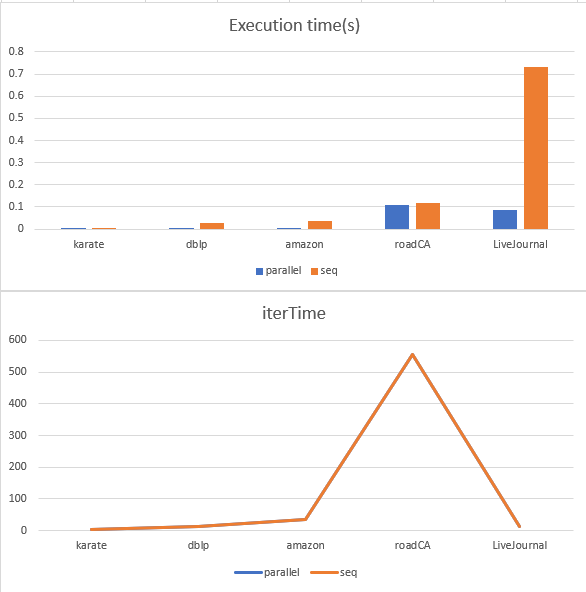

# BFS
1. ### [Compile.sh](#compilesh-1)
2. ### [Sequential BFS](#sequential-bfs-1)
3. ### [Parallel BFS](#parallel-bfs-1)
    - [CudaBFS_2007](#cudabfs_2007)

- ### [Environment](#environment-1)
- ### [Dataset Perprocess Tool](#dataset-perprocess-tool-1)

# Compile.sh
```bash
#if got error after performing compile.sh : permission denied
#go to the folder that contain the compile.sh and use the command below
$ chmod u+x *.sh
```

# Sequential BFS
```bash
#Compile example.c in the folder "SequentailBFS"
$ ./complie.sh
#It will create a executable file "a".

#execute "a" should go with the parameters like : datasetPath, mode, startNode, whereas the mode = 1 represent adpating CSR, mode = 0 adapting Adjlist.
#./a <datasetPath> <mode> <startNode>
$./a karate.txt 1 10 #an example of the command to perform sequential BFS
```

# Parallel BFS
- Note
    - In cuda file(*.cu), if we want to use the library written by ourself, it should be included as the form below.<br>
        ```c
        //example
        extern "C"{
            #include "../../Lib/CSR/CSR.h"
        }
        ```
- ### CudaBFS_2007
    ```bash
    #Compile cudabfs2007.cu in the folder CudaBFS_2007
    $ ./compile.sh
    #It will create a executable file "a".

    #execute "a" should go with the parameters like : datasetPath, startNode.
    #./a <datasetPath> <startNode>
    $./a ../../Datasets/dblp.txt 10 #an example of the command to perform CudaBFS_2007.
    ```
    #### Experiments
    
    #### Reference(with hyperlink)
    1. [cuda_bfs](https://github.com/siddharths2710/cuda_bfs/blob/master/cuda_bfs/kernel.cu)
    2. [Paper](https://www.nvidia.com/content/cudazone/CUDABrowser/downloads/Accelerate_Large_Graph_Algorithms/HiPC.pdf)

# Environment
- CPU : Intel(R) Core(TM) i7-4790K CPU @ 4.00GHz
- GPU : GeForce GTX 1060 6GB

# Dataset Perprocess Tool
- ConvertNodeID.cpp in "Datasets/UnusableDataset/"
    ```bash
    #function : It compacts nodeID so that no one nodeID will exceed the vertex number

    #compile ConvertNodeID.cpp
    $g++ convertNodeID.cpp -o a
    #perform convertNodeID
    #$./a <InputDatasetPath> <OutputDatasetPath>
    $./a com-livejournal.txt LiveJournal.txt
    #It will output a file of dataset with compacted nodeID named "LiveJournal.txt"
    ```
- ChangeDataset.cpp in "Datasets/UnusableDataset/"
    ```bash
    #function : It deletes the first lines and writes the nodeNum and edgeNum at the head line.

    #compile ChangeDataset.cpp
    $g++ ChangeDataset.cpp -o a
    #perform ChangeDataset
    #$./a <datasetReadPath> <datasetWritePath> <number of lines> <nodeNum> <edgeNum>
    $./a com-livejournal.txt LiveJournal.txt 4 3997962 34681189
    ```